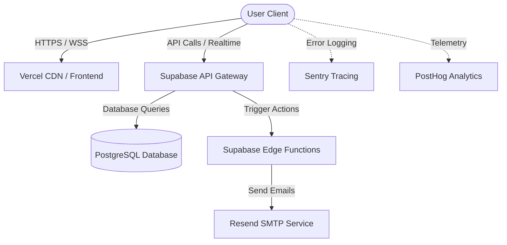

# SwapNet 

[](https://react.dev)
[](https://www.typescriptlang.org)
[](https://supabase.com)
[](https://vercel.com)
[](https://opensource.org/licenses/MIT)

SwapNet is a production-ready, peer-to-peer skill-sharing SaaS platform that connects ambitious individuals to trade skills directly—**completely free and without money**.

🔗 **Live Demo**: [skillbridge-mu-green.vercel.app](https://skillbridge-mu-green.vercel.app)  

<!-- 📂 **GitHub Repository**: [github.com/prashant4840/SwapNet](https://github.com/prashant4840/SwapNet)

---
-->
## 1. Project Overview

### What SwapNet Is
SwapNet is a modern, collaborative platform designed for builders, developers, creators, and lifelong learners. Instead of paying for tutorials or bootcamps, users swap their expertise. You teach what you know, and learn what you need in return.

### The Problem It Solves
Access to high-quality learning is often locked behind expensive subscription fees, paywalls, or rigid curriculums. Meanwhile, experienced professionals have valuable skills but lack structured, trust-based networks to exchange knowledge directly with peers.

### Key Value Proposition
* **Reciprocity-First Matching**: A proprietary scoring algorithm finds optimal compatibility pairs based on what you teach and what you want to learn.
* **Reputation System**: Completed swaps, reviews, and badges build community trust.
* **SaaS Capabilities**: High-priority transactional email delivery, progressive pagination, database rate-limiting, and error-trace visibility.

---

## 2. Architecture Overview

SwapNet leverages a modern serverless, event-driven architecture designed to minimize latency and ensure resilience.



### Flow Breakdown
1. **Frontend App**: SPA built with React 19 + TypeScript + Tailwind CSS and deployed on Vercel's global edge network.
2. **Supabase Layer**: Manages JWT user authentication, row-level security (RLS) policies, and handles PostgreSQL websocket subscriptions for real-time messaging.
3. **Edge Processing**: Deno Edge Functions handle external API calls (e.g., email delivery via Resend) and process queued email retries with exponential backoffs.
4. **Data Durability**: A PostgreSQL database manages optimized relational schemas, automatic triggers, and audit logging.

---

## 3. Core Features

* **Secure Authentication**: Built-in signups, password resets, and session recovery backed by Supabase Auth.
* **Skill Discovery Feed**: Fast, search-optimized catalog filtering members by compatibility, city location, rating, and mode.
* **Interactive Swap Requests**: Send structured exchange requests outlining exactly which skills you offer to swap.
* **Real-time Chat & Inbox**: Instant messaging with websocket support to coordinate sessions, featuring automatic email alerts for unread messages.
* **Trust Reviews**: Submit ratings and feedback upon swap completion to build profile status badges (e.g., "Top Rated").
* **Abuse Control & Moderation**: Admin diagnostics console to manage reported profiles, ban users, and inspect server logs.
* **Analytics & Performance Tracking**: Live conversions monitored in Sentry, Vercel, and PostHog.

---

## 4. Tech Stack

* **Frontend**: React 19, TypeScript, Tailwind CSS, Framer Motion, Recharts
* **Backend & Database**: Supabase, PostgreSQL, Deno Deploy (Edge Functions)
* **Email & Integrations**: Resend, Sentry (Error logs), PostHog & Vercel Analytics (Telemetry)
* **Testing**: Vitest, Playwright (E2E Browser testing)

---

## 5. UI Showcase

Below are E2E browser verification screenshots showing the platform layout:

| Page / Interface | View Snapshot |
| --- | --- |
| **Landing Frame** <br> *Marketing and call-to-actions* |  |
| **User Discovery** <br> *Compatibility grid and filters* |  |
| **Direct Messaging** <br> *Websocket chat threads* |  |
| **Admin Console** <br> *Log tracers and queue analytics* |  |
| **Member Profile** <br> *Public resume and reviews list* |  |

<!-- | **Mobile Adaptability** <br> *Fully responsive viewport* |  |
-->

---

## 6. Local Setup

### Prerequisites
* Node.js (v18 or higher)
* Supabase Account / Supabase CLI (optional)

### Installation Steps
1. Clone the repository:
   ```bash
   git clone https://github.com/prashant4840/SwapNet.git
   cd SwapNet
   ```
2. Install package dependencies:
   ```bash
   npm install
   ```
3. Configure environment variables. Create a `.env` file in the project root:
   ```env
   VITE_SUPABASE_URL=your-supabase-url
   VITE_SUPABASE_ANON_KEY=your-supabase-anon-key
   VITE_SENTRY_DSN=your-optional-sentry-dsn
   ```
4. Start the local development server:
   ```bash
   npm run dev
   ```
5. Run the test suite:
   ```bash
   npm run test
   ```
6. Build for production:
   ```bash
   npm run build
   ```

---

## 7. Production Hardening Features

SwapNet includes features that elevate it from a simple MVP to a secure, enterprise-ready SaaS application:

* **Progressive Range Pagination**: Discovery feeds, message inboxes, and notification lists use range limits instead of fetching whole tables, keeping Supabase API consumption optimal.
* **Database Rate-Limiting**: PostgreSQL database triggers (`enforce_rate_limits`) restrict insert flooding (e.g., maximum 3 chat messages per 5 seconds, 30 seconds delay between posts) to prevent spam.
* **Exponential Backoff Email Queue**: Outbound transactional emails are persisted to `public.email_queue` and processed asynchronously. Failed attempts recalculate a backoff timeline ($2^{n}$ minutes) up to 5 times before moving to a Dead Letter Queue (DLQ).
* **Strict Content Security Policy (CSP)**: `vercel.json` enforces secure HTTP headers (`X-Frame-Options: DENY`, `Strict-Transport-Security`) and CSP rules restricting script executions.
* **System Log Trace Inspector**: Frontend and Edge Function errors are logged directly to `public.error_logs` with unique correlation IDs, allowing administrators to debug trace stacks instantly from the Admin Page.
* **Bundle Splitting**: Heavy modules like Recharts and Framer Motion are compiled into separate lazy chunks, dropping the dashboard bundle footprint from **356.50 kB to 16.69 kB**.

---

## 8. Future Roadmap

- [ ] **AI-Powered Skill Matcher**: Analyze user bios and profiles to suggest high-compatibility learning paths automatically.
- [ ] **Native Mobile Application**: Build iOS and Android versions using React Native.
- [ ] **Interactive Interactive Swapping**: Video/Audio integrations to host sessions directly within the SwapNet app.
- [ ] **Community Class Events**: Support one-to-many workshops and group classes.

---

## License

Distributed under the MIT License. See [LICENSE](LICENSE) for more information.

**Developed by Prashant Sharma**

## Contact

For inquiries: `prashantsharma4849@gmail.com`
