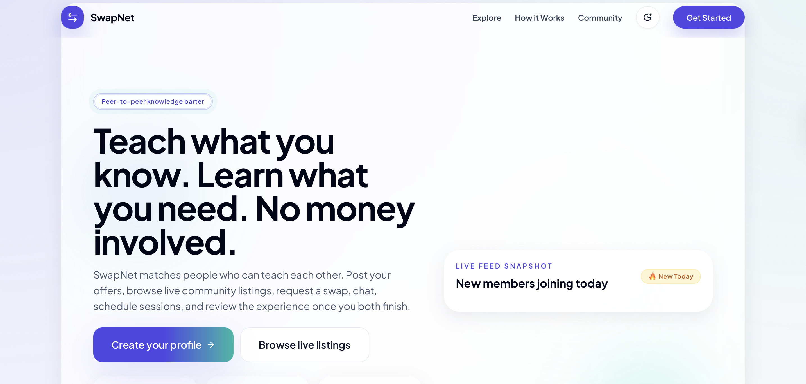
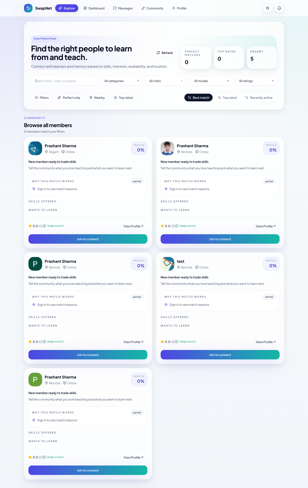
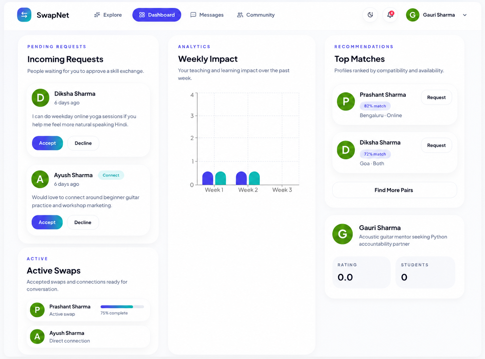
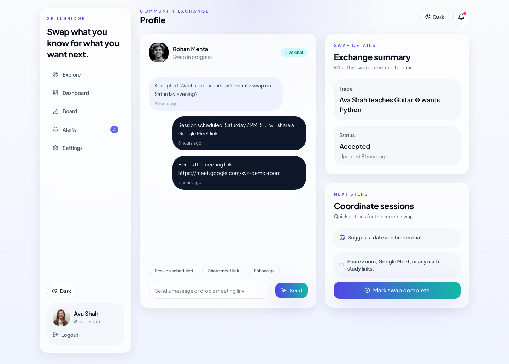
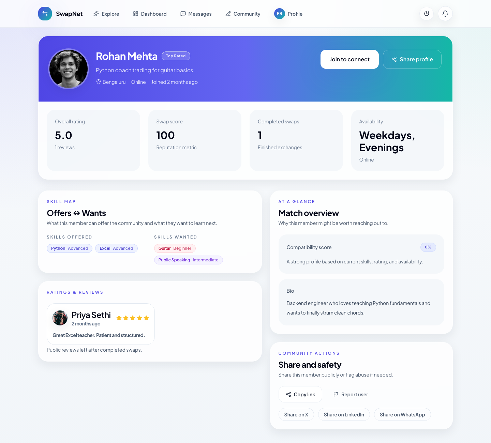
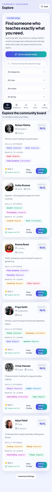

# SkillBridge

SkillBridge is a modern Skill Swap Platform built with React, Tailwind, Framer Motion, React Router, and a Supabase-ready data model. Users can offer a skill they know, request a skill they want to learn, send swap requests, chat after acceptance, and leave ratings when the exchange is complete.

The app works out of the box in demo mode with seeded local data and becomes ready for real Supabase-backed auth and storage when `VITE_SUPABASE_URL` and `VITE_SUPABASE_ANON_KEY` are configured.

## Highlights

- Email signup/login flow with persistent demo auth
- Google auth button wired for Supabase OAuth, with a demo fallback when env vars are missing
- Profile editor with bio, city, optional age, availability, mode, custom skill tags, and completion progress
- Live explore feed with search, filters, smart match scores, and reciprocal `Perfect Match 🎯` badges
- Swap request workflow with pending, accepted, declined, and completed states
- Real-time-style preserved chat threads after acceptance
- Ratings and reviews after swap completion
- Dashboard with active swaps, pending requests, completed swaps, charts, and swap score
- Community board for `Looking for` posts
- Dark mode, responsive sidebar/bottom nav layout, and Framer Motion transitions
- 10+ seeded profiles plus sample requests, reviews, chats, and notifications

## Tech Stack

- React 19
- TypeScript
- Vite
- Tailwind CSS
- Framer Motion
- React Router v6
- Supabase client
- Recharts
- Lucide React
- React Hot Toast
- Playwright for browser verification

## Demo Credentials

- Email: `ava@skillbridge.app`
- Password: `demo-pass`

## Screenshots

### Landing



### Explore Feed



### Dashboard



### Chat



### Public Profile



<!-- ### Mobile Explore

 -->

### Mobile

| Explore | Profile | Chat |
|--------|---------|------|
|  |  |  |

## Local Setup

1. Install dependencies:

   ```bash
   npm install
   ```

2. Start the dev server:

   ```bash
   npm run dev
   ```

3. Open the app at `http://127.0.0.1:5173` unless you override the port.

4. Optional: copy `.env.example` to `.env` and add Supabase credentials.

## Available Scripts

- `npm run dev` starts the Vite dev server
- `npm run build` creates the production build
- `npm run lint` runs ESLint
- `npm run preview` serves the production build locally
- `npm run verify:browser` runs the Playwright route walkthrough and refreshes screenshots

## Supabase Setup

The app includes a Supabase-ready client helper at [`src/lib/supabase.ts`](/Users/prashantsharma/SkillBridge/src/lib/supabase.ts).

To provision the backend:

1. Create a new Supabase project.
2. Run [`supabase/schema.sql`](/Users/prashantsharma/SkillBridge/supabase/schema.sql).
3. Run [`supabase/seed.sql`](/Users/prashantsharma/SkillBridge/supabase/seed.sql).
4. Add your keys to `.env`:

   ```bash
   VITE_SUPABASE_URL=...
   VITE_SUPABASE_ANON_KEY=...
   ```

5. In Supabase Auth, enable Google as an OAuth provider if you want real Google login instead of the demo fallback.

## Deployment

This repo includes a Vercel SPA rewrite config at [`vercel.json`](/Users/prashantsharma/SkillBridge/vercel.json) so React Router routes resolve correctly in production.

Typical deployment flow:

```bash
npm install
npm run build
vercel
```

## Architecture Notes

- The UI is fully functional in demo mode using persistent local state seeded from [`src/data/seed.ts`](/Users/prashantsharma/SkillBridge/src/data/seed.ts).
- The database schema mirrors the requested entities: users, skills offered, skills wanted, swap requests, chats, reviews, notifications, posts, and abuse reports.
- Chat persistence is modeled against Supabase tables and also works locally for seeded/demo workflows.
- Browser verification is scripted in [`scripts/verify.mjs`](/Users/prashantsharma/SkillBridge/scripts/verify.mjs).

## Verification

These checks were run successfully:

```bash
npm run build
npm run lint
npm run verify:browser
```

The browser verification confirmed that `/`, `/explore`, `/auth`, `/dashboard`, `/chat/swap-ava-rohan`, and `/profile/ava-shah` render without console errors or page errors.
